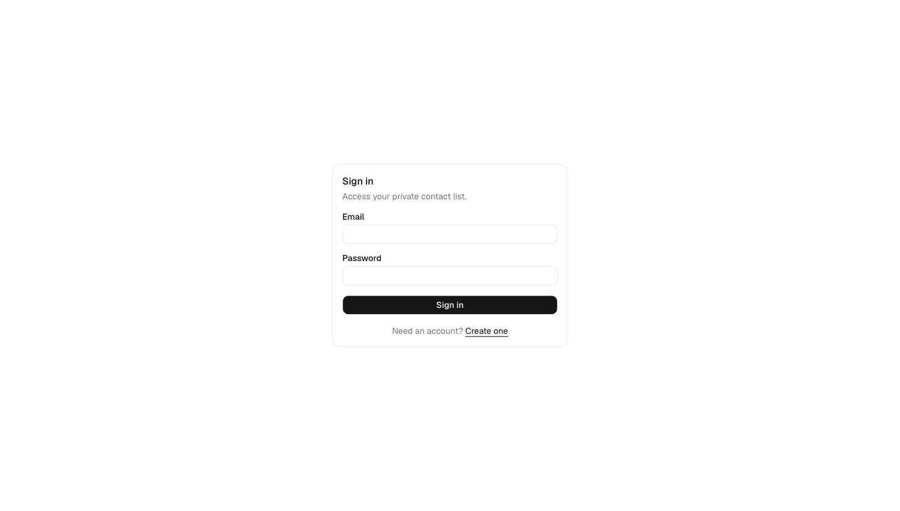
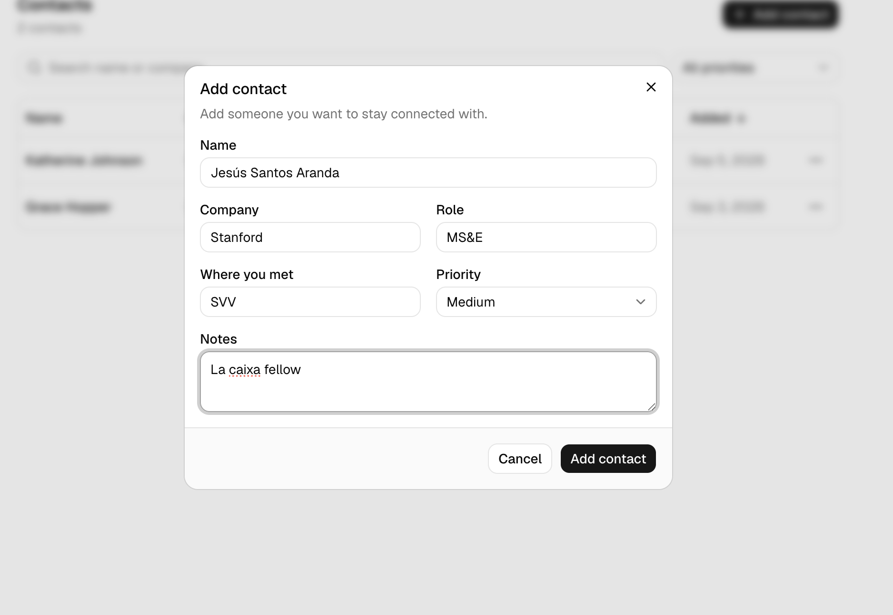
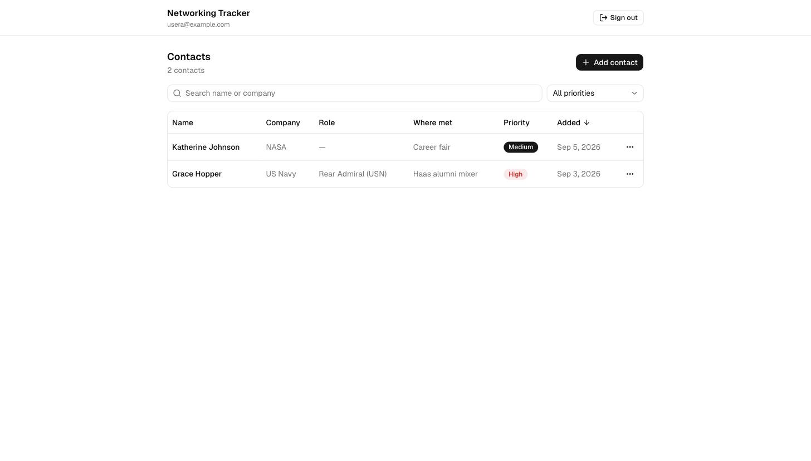
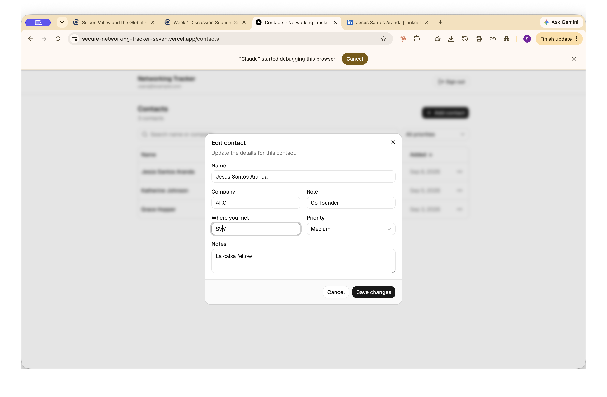
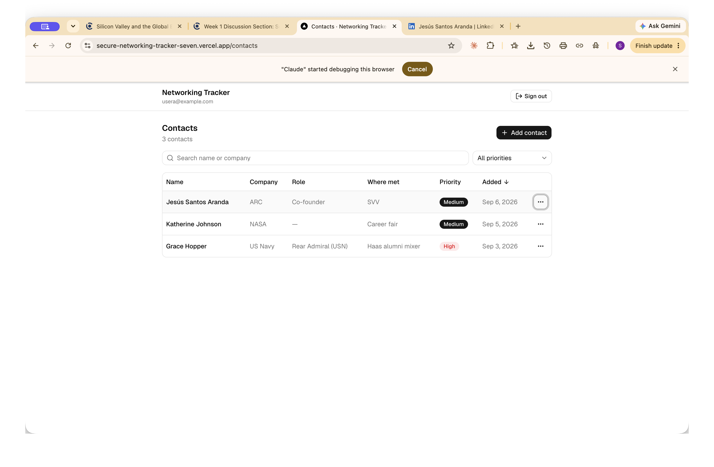
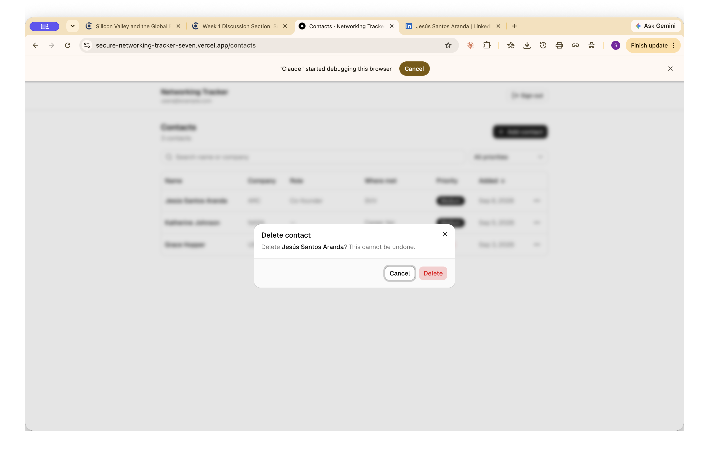
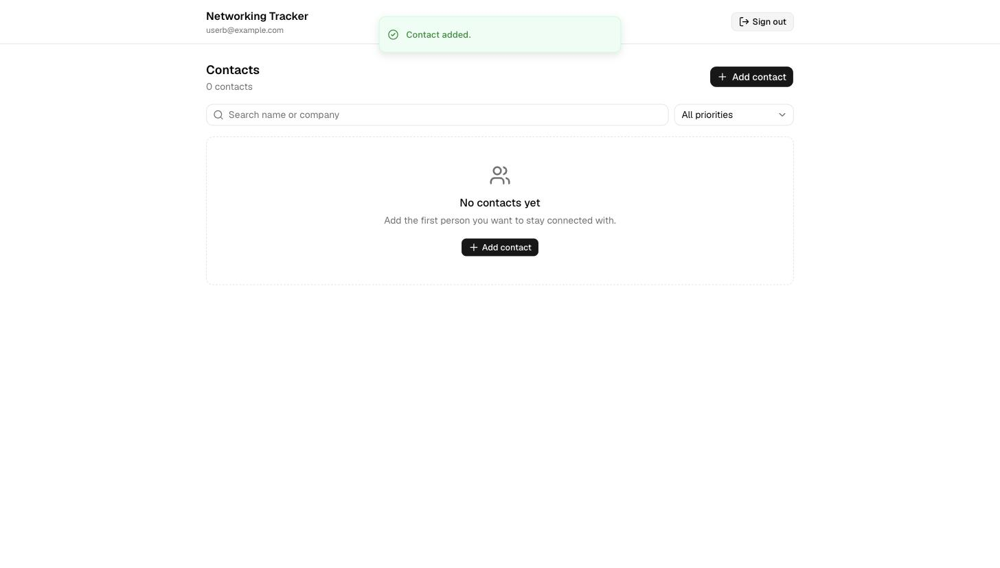
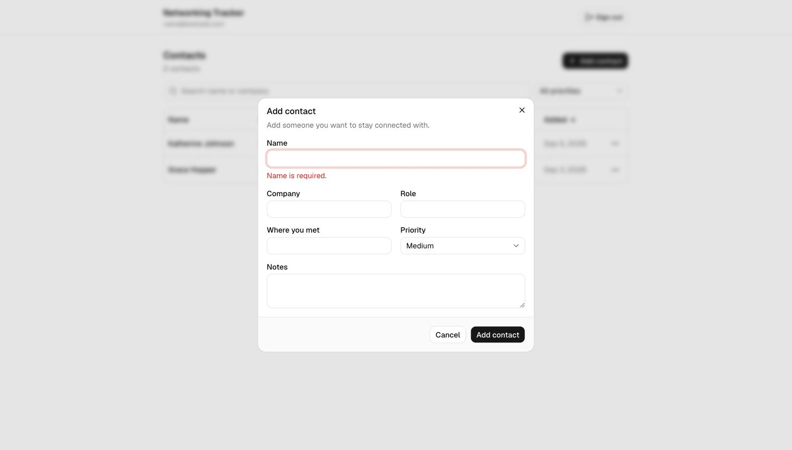

# Secure Networking Tracker

> **Status:** ✅ Live on Vercel and verified end to end — sign up / in / out,
> create / edit / delete / sort / filter, refresh persistence, validation, and
> the two-account privacy check all pass against the production deployment.

A private web app for keeping track of the people you want to stay connected
with at Berkeley. Each user signs in, keeps their own contact list (name,
company, role, where you met, notes, priority), and can create, edit, delete,
sort, and filter those contacts. Every contact row is protected at the database
level by Postgres Row Level Security, so one user can never read or change
another user's contacts — even though the browser talks to a public data API.

---

## Live app

**Live URL:** https://secure-networking-tracker-seven.vercel.app
**Repository:** https://github.com/silviadiazderada/secure-networking-tracker

---

## Product walkthrough / screenshots

Screenshots are in [`docs/screenshots/`](docs/screenshots/).

**Sign in** — unauthenticated visitors are sent here; the contacts page is gated.
Signing out from the header clears the session and returns to this screen.



**Create a contact** — name, company, role, where you met, notes, and a
priority of high / medium / low.



**A signed-in user's private contact list** — sortable columns, priority filter,
search, and per-row edit / delete.



**Edit a contact** — the dialog opens pre-filled…



…and the change persists (company / role updated in the list, and it survives a
page refresh because it is stored in Neon Postgres).



**Delete a contact** — a confirmation step guards the irreversible action.



**Two-account privacy check** — User A (above) has contacts. A second account,
`userb@example.com`, signed into the same production app, sees none of them:
Row Level Security filters every Data API response to the signed-in user.



**Invalid input fails safely** — an empty name is rejected client-side before
any request, and the database `CHECK` constraint would reject it regardless.



---

## Features

- Email + password sign up, sign in, and sign out (Neon Managed Better Auth)
- A private contact list per authenticated user
- Add a contact with **name, company, role, where met, notes, priority**
- Priority is restricted to **high**, **medium**, or **low**
- View contacts in a sortable table (desktop) / card list (mobile)
- Edit and delete your own contacts
- Sort by name, company, priority, or date added
- Filter by priority and free-text search on name / company
- Clear **loading, empty, success, and error** states
- Contacts persist across refresh (stored in Neon Postgres)
- Empty names and invalid priority values fail with a clear message
- Responsive layout for web and mobile

---

## Technology stack and why

| Layer | Choice | Why |
| --- | --- | --- |
| Framework | **Next.js (App Router)** | One deploy target on Vercel; clean split between the React client and the data/security layer. |
| Language | **TypeScript** | Shared types between the form, the validation rules, and the database row shape. |
| Styling | **Tailwind CSS + shadcn/ui** | A real component system (accessible primitives, consistent design tokens) that is responsive by default. |
| Auth | **Neon Managed Better Auth** | Managed authentication; the app only stores a public auth URL and never runs its own auth server. |
| Data access | **Neon Data API** via **`@neondatabase/neon-js`** (two-URL client) | The browser reads and writes through a managed PostgREST API using the signed-in user's JWT. No custom backend to secure. |
| Database | **Neon Postgres** | Serverless Postgres; Row Level Security is the enforcement boundary between users. |
| Validation | **Postgres `CHECK` / `NOT NULL` constraints** + a shared `validateContact()` function | The database rejects invalid data no matter what the client does; the shared function gives friendly inline errors. |
| Tests | **Vitest** | Fast unit tests for the validation rules. |
| Hosting | **Vercel** | Git-push deploys, preview URLs, environment variable management. |
| Source control | **Git + GitHub** (public repo) | Required deliverable. |

---

## Architecture summary

```
Browser (Next.js React client)
  │
  │  1. Sign in / up / out           ──▶  Neon Managed Better Auth
  │     (NEXT_PUBLIC_NEON_AUTH_URL)        issues a session JWT
  │
  │  2. Read / write contacts        ──▶  Neon Data API  (managed PostgREST)
  │     via @neondatabase/neon-js          (NEXT_PUBLIC_NEON_DATA_API_URL)
  │     with Authorization: <JWT>          │
  │                                        ▼
  │                                   Neon Postgres
  │                                     public.contacts
  │                                     + CHECK / NOT NULL constraints  (validation)
  │                                     + RLS policies scoped to auth.user_id()  (isolation)
```

- **Frontend** — React client components: auth screens, the contact list, the
  create/edit form, and the sort/filter controls. It holds no database
  credentials; it only knows the two public URLs.
- **Backend** — the Neon Data API (a managed REST layer over Postgres) plus the
  database itself. All "server-side" logic that matters — validation and access
  control — lives in the database as constraints, RLS policies, and a trigger.
- **Database** — a single `public.contacts` table. See
  [Database schema](#database-schema).
- **Authentication** — Neon Managed Better Auth. On sign in the client receives
  a JWT; `@neondatabase/neon-js` attaches it to every Data API request, and
  Postgres resolves `auth.user_id()` from it.
- **Hosting** — Vercel builds and serves the Next.js app. The Postgres
  connection string is never deployed; production data access is Data API only.

---

## Local setup

```bash
# 1. Clone
git clone https://github.com/silviadiazderada/secure-networking-tracker.git
cd secure-networking-tracker

# 2. Install
npm install

# 3. Configure environment
cp .env.example .env.local
#   Fill in the values from the Neon console (see .env.example for what each is).

# 4. Create the database schema, constraints, and RLS policies
npm run db:migrate

# 5. Run
npm run dev
#   http://localhost:3000
```

---

## Environment variables

Names only — see [`.env.example`](.env.example) for placeholders. Real values
are never committed.

| Variable | Exposure | Purpose |
| --- | --- | --- |
| `NEXT_PUBLIC_NEON_AUTH_URL` | public | Better Auth endpoint the client uses for sign in / up / out |
| `NEXT_PUBLIC_NEON_DATA_API_URL` | public | Neon Data API endpoint the client reads/writes contacts through |
| `DATABASE_URL` | **server-only** | Direct Postgres connection; used **only** by `npm run db:migrate`, never by the deployed app |
| `NEON_AUTH_BASE_URL` | server-only | Only if a Better Auth server helper is added |
| `NEON_AUTH_COOKIE_SECRET` | server-only | Only if a Better Auth server helper is added |

---

## Database schema

Table: `public.contacts` (defined in
[`db/migrations/0001_init.sql`](db/migrations/0001_init.sql)).

| Column | Type | Notes |
| --- | --- | --- |
| `id` | `uuid` | Primary key, `default gen_random_uuid()` |
| `user_id` | `text` | **`not null`, `default auth.user_id()`** — the owner |
| `name` | `text` | `not null`; `check (btrim(name) <> '')`; `check (char_length(name) <= 200)` |
| `company` | `text` | nullable |
| `role` | `text` | nullable |
| `where_met` | `text` | nullable |
| `notes` | `text` | nullable |
| `priority` | `text` | `not null`, `default 'medium'`; `check (priority in ('high','medium','low'))` |
| `created_at` | `timestamptz` | `not null`, `default now()` |
| `updated_at` | `timestamptz` | `not null`, `default now()`; kept current by trigger `contacts_set_updated_at` |

---

## Authentication and Row Level Security ownership

- A user authenticates through **Neon Managed Better Auth** and the client
  receives a **JWT**. `@neondatabase/neon-js` sends that JWT on every Data API
  request.
- Postgres exposes **`auth.user_id()`**, which returns the current request's
  user id from that JWT.
- `public.contacts.user_id` **defaults to `auth.user_id()`** and is **`not
  null`**, so a new row always belongs to the caller even if the client never
  sends a `user_id`.
- RLS is **enabled and forced** on `contacts`, with a **separate policy per
  operation**, each requiring `user_id = auth.user_id()`:
  - `contacts_select` — `USING (user_id = auth.user_id())`
  - `contacts_insert` — `WITH CHECK (user_id = auth.user_id())`
  - `contacts_update` — `USING (...)` **and** `WITH CHECK (...)` so a user
    cannot edit someone else's row **and** cannot reassign their own row to
    another user
  - `contacts_delete` — `USING (user_id = auth.user_id())`
- The `anon` role (no JWT) is granted nothing on `contacts`.

**Result:** every query the Data API runs is silently filtered to the signed-in
user's rows. User A asking for User B's contact id gets an empty result;
attempts to update or delete it affect zero rows.

---

## Tests

```bash
npm test
```

**`src/test/validation.test.ts`** — unit tests for `validateContact()`, the
shared rule set mirrored by the database `CHECK` constraints:

- a well-formed contact is accepted and normalized
- an **empty name** is rejected
- a **whitespace-only name** is rejected
- a **priority outside `high | medium | low`** is rejected
- each allowed priority value is accepted
- blank optional fields become `null`
- an over-long name is rejected

**`src/test/rls.test.ts`** — the automated two-account privacy test. It runs
against the live Neon Data API: signs in as two accounts, exchanges each
session for a JWT, then proves Row Level Security holds:

- User A can read its own contact
- **User B cannot read User A's contact** (select policy)
- **User B cannot update User A's contact** — and A's data is unchanged
- **User B cannot delete User A's contact**
- **User B cannot insert a row it labels as owned by User A** — `403` from the
  `WITH CHECK` clause

It needs `RLS_TEST_USER_*` env vars (see `.env.example`) and skips cleanly if
they are absent, so `npm test` always passes at least the validation suite.

```
✓ validation.test.ts  (7 tests)
✓ rls.test.ts > RLS: one user cannot touch another user's contacts
  ✓ A can read its own new contact
  ✓ B cannot read A's contact (RLS select policy)
  ✓ B cannot update A's contact (RLS update policy)
  ✓ B cannot delete A's contact (RLS delete policy)
  ✓ B cannot create a row owned by A (RLS insert WITH CHECK)
  ✓ cleanup: A deletes the test contact

Test Files  2 passed (2)
     Tests  13 passed (13)
```

---

## Deployment

The app is deployed on Vercel, linked to this GitHub repo — every push to
`main` triggers a new production build.

**How it was deployed:**

1. Pushed the repo to GitHub (public).
2. Imported it at [vercel.com/new](https://vercel.com/new); Vercel auto-detected
   Next.js — no build settings changed.
3. Added two production environment variables in Vercel (both public, both
   `NEXT_PUBLIC_`):
   - `NEXT_PUBLIC_NEON_AUTH_URL`
   - `NEXT_PUBLIC_NEON_DATA_API_URL`

   `DATABASE_URL` is **not** set in Vercel — it is only used locally by
   `npm run db:migrate`.
4. Added the deployment domain (`https://secure-networking-tracker-seven.vercel.app`)
   to **Neon Auth → Configuration → Domains** (trusted origins). Without this,
   Better Auth rejects sign-in from the deployed origin with `INVALID_ORIGIN`.
5. Opened the live URL in a fresh browser, created two accounts, and repeated
   the privacy test against production.

**Redeploy:** push to `main`, or run `npx vercel --prod` from the project root.

---

## Evidence

- [x] **Automated test output** — `npm test`, 13 passing (see [Tests](#tests))
- [x] **Sign in / sign out** — [`docs/screenshots/01-sign-in.jpg`](docs/screenshots/01-sign-in.jpg);
      the header's "Sign out" button clears the session and returns to sign-in
- [x] **Create / edit / delete / refresh** — screenshots of the
      [create](docs/screenshots/02-create-contact.png),
      [edit](docs/screenshots/06-edit-contact.png) →
      [persisted](docs/screenshots/07-edit-persisted.png), and
      [delete](docs/screenshots/08-delete-contact.png) flows on the production
      app; an edited contact survives a full page reload (stored in Neon
      Postgres)
- [x] **Two-account test** — automated in `src/test/rls.test.ts`, plus
      screenshots: [User A's list](docs/screenshots/03-user-a-contacts.jpg) vs
      [User B's empty list](docs/screenshots/04-user-b-empty-list.jpg) on the
      same production app
- [x] **Invalid input fails safely** — [`docs/screenshots/05-validation-error.jpg`](docs/screenshots/05-validation-error.jpg)
- [x] **Schema + RLS ownership explanation** — see
      [Authentication and Row Level Security ownership](#authentication-and-row-level-security-ownership)
- [x] **Public GitHub repo, no committed secrets** —
      https://github.com/silviadiazderada/secure-networking-tracker
      (`.env.local` is gitignored; only `.env.example` with placeholders is
      committed)

---

## Known limitations and next improvements

- **Auth is email + password only** — no OAuth, no email verification, no
  password reset. Neon Managed Better Auth supports these; they were out of
  scope for a small secure app.
- **No pagination** — the contact list loads all of a user's rows at once.
  Fine for a personal networking list; would need cursor pagination at scale.
- **Sort and filter run client-side** for the priority-rank ordering; the
  priority filter and text search are pushed to the Data API. All of it still
  operates only on the signed-in user's rows (RLS).
- **No optimistic UI / undo** — mutations refetch the list, so there is a brief
  spinner and no "undo delete".
- **RLS test uses shared example accounts** — `src/test/rls.test.ts` needs two
  pre-created accounts supplied via env vars; it does not create or tear them
  down.
